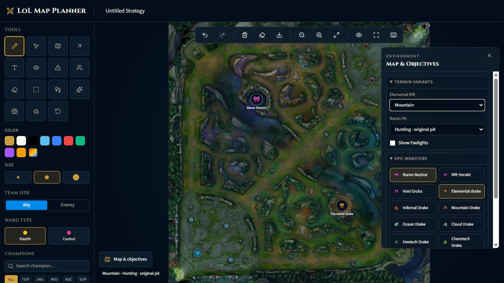

# LoL Map Planner — editor de mapas y estrategia

Proyecto personal de **Ignacio Garrido**, Ingeniero en Informática titulado. Desarrollo propio de la aplicación; librerías, plantillas, datos e imágenes de terceros conservan su autoría.

Proyecto conocido localmente como **proyecto-codigo**. Editor interactivo con React, TypeScript, TanStack Start, Konva/react-konva y Zustand. Permite crear una estrategia visual con terreno, visión, rutas y posiciones.



## Funciones implementadas
- Lápiz, flechas, texto, zonas de peligro, selección múltiple, wards, campeones y oleadas.
- Rutas A→B que evitan muros y estiman distancia y tiempo; comparación caminar/recall.
- Visión que considera obstáculos y arbustos, niebla de guerra y Faelights.
- Selección manual de mapa base o seis terrenos elementales y tres formas del foso de Barón.
- Iconos de objetivos épicos, configuración de velocidad, Homeguard y efectos de movimiento.
- Estado local, recuperación de sesión, historial deshacer/rehacer, zoom, paneo, pantalla completa y exportación PNG.

## Demo local
Node 22.18+:
```powershell
npm ci
npm run dev -- --host 127.0.0.1 --port 5173
```
Abre `http://127.0.0.1:5173`. No requiere cuentas ni base de datos. El catálogo e imágenes de campeones consumen recursos públicos de CommunityDragon y requieren internet; el editor y los mapas incluidos funcionan localmente.

Recorrido de 2 minutos: abre «Map & objectives», cambia a Mountain, selecciona una herramienta, dibuja una ruta o ward, usa Undo/Redo y exporta PNG. La captura muestra el editor realmente ejecutado, no una maqueta.

## Comprobaciones
```powershell
npm run check
npm run terrain:check
```
Verificado: lint (0 errores, 7 advertencias de Fast Refresh), TypeScript, geometría, persistencia, teclado, las 21 combinaciones de terreno y comprobación adicional de Ocean. Build completado y variante Mountain probada en navegador.

## Diseño y límites
React organiza paneles; Konva dibuja el lienzo; Zustand mantiene elementos e historial; `src/lib/rift.ts` concentra geometría, desplazamiento y visión; `terrain-data.ts` conserva máscaras editadas. No hay backend de cuentas ni colaboración simultánea. Las geometrías y tiempos son aproximaciones de planificación, no una reproducción exacta del motor del juego. Las rutas de caminata no simulan todas las habilidades o portales. No se ejecutaron los scripts opcionales de descarga de replays; no se incluyen replays o datos personales.

Documentación: [arquitectura](docs/arquitectura.md), [mapas](docs/mapas.md), [revisión](docs/revision.md) y [créditos](THIRD_PARTY.md).

English: a terrain-aware strategy editor with obstacle-aware pathfinding, vision geometry, local history and PNG export. Verified geometry/state checks and production build; game simulation is approximate.
